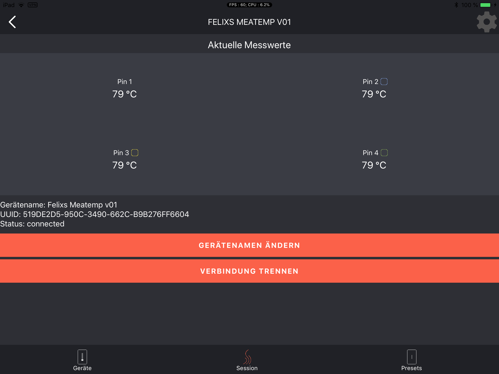

# Meati App
`A hybrid-native Angular/Nativescript App`
### Official Nativescript References:
[NativeScript Starter Tutorial Chapter 1](https://docs.nativescript.org/angular/tutorial/ng-chapter-1)  
[NativeScript API Reference](https://docs.nativescript.org/api-reference/globals)

## Specifications

	Nativescript 
	SHA512-encrypted passwords
	Angular 5.2
	TypeScript 2.6
	RxJS 5.5
	

	
## Installation
### Requirements
The NativeScript CLI is built on **Node.js**, and as such you need to have Node.js installed to use NativeScript.

Open your terminal or command prompt and execute the following command to install the NativeScript CLI from **npm**, which is the Node.js package manager:

	npm install -g nativescript

After completing the setup there should be two commands available on the terminal/command prompt: tns (short for Telerik NativeScript) and nativescript. The two commands are identical, so we'll stick with the shorter tns.
	
	$ tns
	# NativeScript
	┌─────────┬─────────────────────────────────────────────────────────────────────┐
	│ Usage   │ Synopsis                                                            │
	│ General │ $ tns <Command> [Command Parameters] [--command <Options>]          │
	│ Alias   │ $ nativescript <Command> [Command Parameters] [--command <Options>] │
	└─────────┴─────────────────────────────────────────────────────────────────────┘
	
### Before first startup

Navigate to the source-Folder of the Meati App:

	cd Core/src/mobile/Meati 

Check, if the file structure looks like this:

	➜  Meati git:(dev_frontend) ✗ ls -la
	total 3960
	drwxr-xr-x   16 felixreichel  staff      512 May 25 10:23 .
	drwxr-xr-x    6 felixreichel  staff      192 May 29 14:23 ..
	-rw-r--r--@   1 felixreichel  staff     6148 May  1 20:15 .DS_Store
	drwxr-xr-x    3 felixreichel  staff       96 Mar 13 10:24 .vscode
	drwxr-xr-x   42 felixreichel  staff     1344 May 20 20:43 app
	drwxr-xr-x    8 felixreichel  staff      256 Mar 13 10:24 hooks
	drwxr-xr-x  574 felixreichel  staff    18368 May 24 20:03 node_modules
	-rw-r--r--    1 felixreichel  staff   203883 May 25 10:23 package-lock.json
	-rw-r--r--    1 felixreichel  staff     2833 May 24 20:03 package.json
	drwxr-xr-x    4 felixreichel  staff      128 May 24 20:03 platforms
	-rw-r--r--    1 felixreichel  staff      275 Mar 13 20:59 references.d.ts
	drwxr-xr-x    4 felixreichel  staff      128 May 20 20:43 report
	-rw-r--r--    1 felixreichel  staff  1786858 May 20 20:43 times.html
	-rw-r--r--    1 felixreichel  staff      594 Mar 13 10:24 tsconfig.json
	-rw-r--r--    1 felixreichel  staff     3041 Mar 13 10:24 tslint.json
	-rw-r--r--    1 felixreichel  staff     6723 Apr 26 20:44 webpack.config.js

Now fetch all node_modules/ specified in package.json and package-lock.json with the command:

	npm install 
	
If you would like to be able to communicate with the API running on your own local mashine or on a custom server you should also modify the URI in the BackendService

	➜  Meati git:(dev_frontend) ✗ cd app/services 
	➜  services git:(dev_frontend) ✗ sudo nano backend.service.ts 

**backend.service.ts:**

	import { Injectable, EventEmitter } from '@angular/core';
	import { HttpClient } from '@angular/common/http';
	import * as connectivity from 'tns-core-modules/connectivity';
	import * as applicationSettings from 'application-settings';
	import { User, LoginCredential, AuthenticationResponse } from '../shared/trans$
	
	@Injectable()
	export class BackendService {
	
	  // change if needed
	  public static API_BASE_URL: string = 'http://meati.ddns.net:8080/api';
	  public static API_BASE_DOMAIN: string = 'http://meati.ddns.net:8080/api';
	

### Execution during developement (proper debugging possible) stage
It's time to start the App. (Connect phone via USB, Developer Options, ...)
If you want faster startup-time and app performance you should use the **npm run prod-{your-platform}**

	npm run dev-android
	npm run dev-ios
	
### Execution on rollout canidates (performance optimized)
	npm run prod-android
	npm run prod-ios
	
**[NOT working currently / building Snapshot fails]** Enables Android V8 Engine Snapshot heap:
	
	npm run prodv8-android

## Developement
### A additional Nativescript Command Line Interface(cli) is in use:
for examle following commant creates a new component including (.ts + .html + .scss):
`tns g[enerate] c[omponent] <component>`

After that you may want to rename the created `.scss` file in a `.less` file, if you are more familiar with the Less preprocessor. Nativescript automatically compiles these file during the build process. Great!

See the documentation on how to create modules, services, pipes, directives and more:

#### [tns-angular-cli](https://www.npmjs.com/package/nativescript-angular-cli)

### Clutter-free development
The VSCode-Workspace settings are configured to hide some files which automatically get compiled each build:

    "files.exclude": {
        "node_modules/": true,
        "platforms/": true,
        "hooks/": true,
        "**/*.js": true,
        "**/*.css": true
    }
    
### Documentation of the used BLE {N}-Plugin:
#### [nativescript-bluetooth] (https://github.com/EddyVerbruggen/nativescript-bluetooth)
 
### Useful links:
* How to use i18n (Internationalization):
* Angular AOT Compiling:
* All Information on Optimization:  

### package.json and dependencies:
		{
	  "name": "meati",
	  "version": "1.0.1",
	  "description": "Meati",
	  "license": "",
	  "readme": "Meati Application",
	  "repository": "<fill-your-repository-here>",
	  "scripts": {
	    "css": "lessc app/shared/less/all.less --compress app/shared/less/all.css",
	    "dev-ios": "npm run css && tns run ios",
	    "dev-android": "npm run css && tns run android",
	    "prod-ios": "npm run css && tns run ios --bundle --env.uglify --env.aot --env.report",
	    "prod-android": "npm run css && tns run android --bundle --env.uglify --env.aot --env.report",
	    "prodv8-android": "npm run css && tns run android --bundle --env.uglify --env.aot --env.snapshot --env.report",
	    "prod-ios-tl": "npm run css && tns run ios --bundle --env.uglify --env.aot --env.report | timeline-view",
	    "prod-android-tl": "npm run css && tns run android --bundle --env.uglify --env.aot --env.report | timeline-view",
	    "prodv8-android-tl": "npm run css && tns run android --bundle --env.uglify --env.aot --env.snapshot --env.report | timeline-view"
	  },
	  "nativescript": {
	    "id": "at.meati.Meati",
	    "tns-android": {
	      "version": "3.4.2"
	    },
	    "tns-ios": {
	      "version": "3.4.1"
	    }
	  },
	  "dependencies": {
	    "@angular/animations": "~5.2.0",
	    "@angular/common": "~5.2.0",
	    "@angular/compiler": "~5.2.0",
	    "@angular/core": "~5.2.0",
	    "@angular/forms": "~5.2.0",
	    "@angular/http": "~5.2.0",
	    "@angular/platform-browser": "~5.2.0",
	    "@angular/platform-browser-dynamic": "~5.2.0",
	    "@angular/router": "~5.2.0",
	    "js-sha512": "^0.7.1",
	    "moment": "^2.22.1",
	    "nativescript-angular": "~5.2.0",
	    "nativescript-bluetooth": "^1.3.1",
	    "nativescript-loading-indicator": "^2.4.0",
	    "nativescript-performance-monitor": "^1.0.0",
	    "nativescript-pulltorefresh": "^2.1.0",
	    "nativescript-theme-core": "~1.0.4",
	    "nativescript-ui-chart": "^3.6.0",
	    "nativescript-ui-dataform": "^3.5.0",
	    "nativescript-ui-listview": "^3.5.1",
	    "reflect-metadata": "~0.1.8",
	    "rxjs": "~5.5.6",
	    "tns-core-modules": "~3.4.0",
	    "zone.js": "~0.8.2"
	  },
	  "devDependencies": {
	    "@angular/compiler-cli": "~5.2.3",
	    "@ngtools/webpack": "~1.9.1",
	    "babel-traverse": "6.4.5",
	    "babel-types": "6.4.5",
	    "babylon": "6.4.5",
	    "copy-webpack-plugin": "~4.3.0",
	    "css-loader": "~0.28.7",
	    "extract-text-webpack-plugin": "~3.0.2",
	    "lazy": "1.0.11",
	    "less": "^2.7.3",
	    "nativescript-dev-typescript": "~0.5.0",
	    "nativescript-dev-webpack": "^0.9.1",
	    "nativescript-worker-loader": "~0.8.1",
	    "raw-loader": "~0.5.1",
	    "resolve-url-loader": "~2.2.1",
	    "tns-platform-declarations": "^3.4.1",
	    "typescript": "~2.6.2",
	    "uglifyjs-webpack-plugin": "~1.1.6",
	    "webpack": "~3.10.0",
	    "webpack-bundle-analyzer": "^2.9.1",
	    "webpack-sources": "~1.1.0"
	  }
	}
